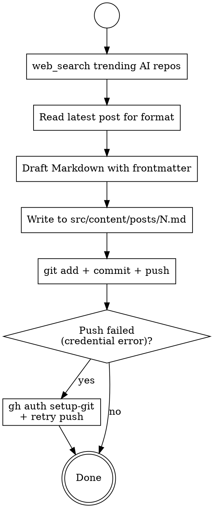

# GitHub AI Weekly Post

## Overview

End-to-end workflow for producing and publishing a weekly GitHub trending AI projects blog post: search trending repos, draft a structured Markdown article following the project's blog conventions, write it to the correct location, then commit and push to GitHub with proper credential handling.

## When to Use

- User says "草拟本周GitHub热门AI博文", "写AI周报", "GitHub周刊", "推送博文" etc.
- Recurring weekly task: search → draft → save → commit → push
- NOT for one-off repo research or non-blog writing tasks

## Workflow



### Step 1: Search Trending Repos

Use `web_search` with 2–3 queries combining English and Chinese:
- `"GitHub trending AI projects this week <month> <year>"`
- `"本周 GitHub 热门 AI 开源项目 <year>年<month>月"`
- `"trending AI repositories GitHub <date>"`

Extract: repo name, URL, stars, language, one-line description. Target 5–8 projects.

### Step 2: Read Previous Post for Format

Use `glob` to find existing posts: `src/content/posts/*.md`
Use `read` on the highest-numbered post to extract:
- Frontmatter schema (title, published, description, tags, category, author, image, draft, pinned)
- Section structure and tone
- Encouragement footer pattern

### Step 3: Determine Next Post Number

From glob results, find max N in `<N>.md`. New post = N+1.

### Step 4: Draft the Post

Follow this template (adapt content, keep structure):

```markdown
---
title: <N>.本周 GitHub 热门 AI 开源项目盘点（<year>年<month>月第<week>周）
published: <YYYY-MM-DD>
description: 盘点本周 GitHub 上最热门的 AI 相关开源项目，涵盖...等方向。
tags: [GitHub热门, AI开源, 周报]
category: GitHub周刊
author: Coldairboy
image: ./images/firefly1.avif
draft: false
pinned: false
---

# 本周 GitHub 热门 AI 开源项目盘点（<year>年<month>月第<week>周）

> 每周精选 GitHub 上最值得关注的 AI 开源项目，帮你紧跟技术前沿。

## 📊 本周概览

| 排名 | 项目 | Stars | 语言 | 亮点 |
|------|------|-------|------|------|
| 1 | [name](url) | XK+ | Lang | ... |

## 1. Project Name — 一句话中文定位

| 项目信息 | 详情 |
|----------|------|
| 仓库 | [owner/repo](url) |
| Star | ⭐ X,XXX |
| 语言 | Lang |
| 简介 | ... |

**亮点：**
- ...

**适用人群：** ...

(Repeat for each project)

## 🔥 本周趋势观察

1. ...
2. ...

## 📌 延伸阅读

- [GitHub Trending](https://github.com/trending)
- ...

---

<div class="encouragement">
🚀 以上就是本周 GitHub 热门 AI 项目盘点！<br>
觉得有用的话，别忘了给这些优秀项目点个 Star ⭐<br>
下周见！
</div>
```

### Step 5: Write File

Use `write` to save to `src/content/posts/<N>.md`.

### Step 6: Commit and Push

```powershell
git -C <workspace> add src/content/posts/<N>.md
git -C <workspace> commit -m "docs: 添加本周GitHub热门AI项目博文(<N>.md)"
git -C <workspace> push
```

Always use `git -C <workspace>` to avoid cwd issues.

### Step 7: Handle Credential Errors

If push fails with `SEC_E_NO_CREDENTIALS` or similar:

1. Run `gh auth status` to verify GitHub CLI is authenticated
2. If authenticated, run `gh auth setup-git` to configure git credential helper
   - This may require `sandbox_permissions: danger-full-access` with justification: "需要写入用户级 .gitconfig 以配置 gh 作为 git 凭据助手"
3. Retry `git -C <workspace> push`

If `gh` is not installed or not authenticated, ask user to choose: gh auth login / PAT / SSH.

## Quick Reference

| Task | Tool | Key Args |
|------|------|----------|
| Find trending repos | web_search | queries array, 2–3 bilingual queries |
| Find existing posts | glob | `src/content/posts/*.md` |
| Read post format | read | file_path, offset/limit for large files |
| Write new post | write | file_path, content (full UTF-8) |
| Git operations | pwsh | command, description; use `git -C <path>` |
| Fix credentials | pwsh | `gh auth setup-git`; may need danger-full-access |

## Common Mistakes

| Mistake | Fix |
|---------|-----|
| Using `cd` then `git push` | Always use `git -C <workspace>` — cwd is unreliable |
| Missing frontmatter fields | Copy exact schema from previous post |
| Forgetting sandbox escalation for gh setup | Add `sandbox_permissions: danger-full-access` + justification |
| Hardcoding post number | Always glob + find max N first |
| Writing English-only content | Blog is Chinese; use Chinese body with English repo names/URLs |

</content>