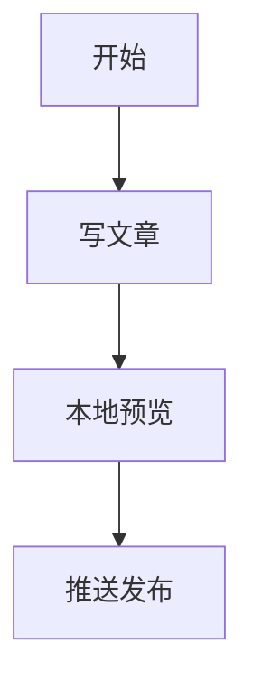

# Markdown写作指南

这篇文章不是纯语法手册，而是给新手看的实操版说明。你可以把它理解成一份“照着做就能写出一篇博客”的速查表。

## 先记住这 6 条

1. Markdown 本质上就是“用简单符号排版普通文字”。
2. 标题前面用 `#`，列表前面用 `-` 或 `1.`。
3. 代码块一定单独成段，不要和正文挤在同一行。
4. 图片、表格、引用前后最好空一行，排版更稳定。
5. 不确定语法时，先本地预览，看到对了再发布。
6. 新手最常见问题不是“不会写”，而是“少了空行、少了反引号、路径写错了”。

## 新手发布一篇文章的最短流程

如果你只是想尽快发一篇文章，先照下面做一遍。

### 第 1 步：启动本地预览

```powershell
cd E:\GITHUB\firefly-replica
pnpm dev
```

启动后，浏览器打开本地地址，看着页面边改边预览。

### 第 2 步：新建或编辑文章文件

这个项目真正读取的是：

```text
src/content/posts/
```

你可以在这个目录里新建一个 Markdown 文件，比如：

```text
src/content/posts/22.md
```

### 第 3 步：先写好文章头信息

```markdown
---
title: 文章标题
published: 2026-04-19
description: 用一句话说明这篇文章写什么
tags: [学习笔记]
category: 博客搭建
author: Coldairboy
image: ./images/firefly1.avif
---
```

### 第 4 步：按这个结构写正文

```markdown
# 文章大标题

开头先用 1 到 2 句话说明这篇文章讲什么。

## 第一部分

正文内容……

## 第二部分

- 要点 1
- 要点 2
- 要点 3

## 总结

最后写一句总结。
```

### 第 5 步：检查效果

重点看这几个地方：

- 标题有没有层级错乱
- 列表有没有挤在同一行
- 代码块有没有完整包住
- 图片能不能正常显示
- 链接能不能点开

### 第 6 步：推送到 GitHub Pages

如果你已经改好内容，直接运行：

```powershell
cd E:\GITHUB\firefly-replica
.\publish-blog.bat
```

如果你之前已经提交过，只是推送失败了，就运行：

```powershell
cd E:\GITHUB\firefly-replica
.\push-only.bat
```

## 最常用的 Markdown 语法

新手前期不用全学，先把下面这些用熟就够了。

### 1. 标题

```markdown
# 一级标题
## 二级标题
### 三级标题
#### 四级标题
```

提醒：

- 一篇文章通常只保留一个 `# 一级标题`
- 不要一级标题后直接跳到四级标题
- 层级尽量按顺序来，看起来更清楚

### 2. 强调文字

```markdown
**粗体**
*斜体*
***粗斜体***
~~删除线~~
`行内代码`
```

适合怎么用：

- 粗体：强调重点
- 行内代码：写命令、文件名、变量名时很好用
- 不要一整段都加粗，不然反而看不出重点

### 3. 无序列表

```markdown
- 第一项
- 第二项
- 第三项
```

### 4. 有序列表

```markdown
1. 第一步
2. 第二步
3. 第三步
```

提醒：

- `1.` 后面要有空格
- 如果序号写在同一行，Markdown 可能不会正确识别
- 子列表要缩进

```markdown
1. 第一步
2. 第二步
   1. 子步骤一
   2. 子步骤二
3. 第三步
```

### 5. 链接

```markdown
[OpenAI](https://openai.com)
[GitHub](https://github.com "GitHub 官网")
```

提醒：

- 方括号里放显示文字
- 小括号里放网址
- 地址最好复制后顺手点开试一次

### 6. 图片

```markdown

```

提醒：

- `!` 不能漏
- 图片说明建议写上，方便阅读和 SEO
- 路径写错是最常见问题

### 7. 引用

```markdown
> 这是一段引用内容
> 可以连续写多行
```

适合用在：

- 摘录一句原话
- 写提示语
- 写总结结论

### 8. 代码块

普通代码块：

````markdown
```
这里放普通代码
```
````

带语法高亮的代码块：

````markdown
```javascript
console.log("Hello");
```

```bash
pnpm dev
```
````

提醒：

- 代码块前后空一行更稳
- 开始和结束的反引号数量必须一致
- 写命令推荐用 `bash` 或 `powershell`
- 写配置推荐用 `json`、`yaml`、`html`、`css`

### 9. 表格

```markdown
| 名称 | 说明 | 备注 |
| --- | --- | --- |
| title | 文章标题 | 必填 |
| published | 发布日期 | 必填 |
| tags | 标签 | 可选 |
```

提醒：

- 表头和分隔线不要漏
- 列太多时，手机上会不太好看
- 新手前期不建议做太复杂的表格

### 10. 分隔线

```markdown
---
```

适合用来分开两个大段落，但不要一篇文章到处乱插。

## 博客里常用的扩展语法

如果只是普通写文章，下面这些够用了。

### 1. 任务列表

```markdown
- [x] 已完成
- [ ] 未完成
- [ ] 待补充
```

适合写待办清单、教程步骤进度。

### 2. 脚注

```markdown
这里有一个说明[^1]

[^1]: 这是脚注内容
```

适合补充说明，不打断正文阅读。

### 3. 数学公式

行内公式：

```markdown
$E = mc^2$
```

块级公式：

```markdown
$$
E = mc^2
$$
```

### 4. Mermaid 图表

````markdown

````

适合画简单流程图。第一次使用时，如果页面不显示，先检查主题是否已开启 Mermaid 支持。

### 5. 提示框

```markdown
::: tip
这是提示信息
:::

::: warning
这是警告信息
:::
```

适合把“重点提醒”单独强调出来。

## 新手最好直接套用的文章模板

不会写结构时，直接复制下面这份最稳。

```markdown
---
title: 文章标题
published: 2026-04-19
description: 一句话简介
tags: [学习笔记]
category: 博客搭建
author: Coldairboy
image: ./images/firefly1.avif
---

# 文章标题

先用一小段话告诉读者：这篇文章解决什么问题。

## 背景

为什么写这篇文章。

## 操作步骤

### 1. 第一步

写步骤说明。

### 2. 第二步

继续写步骤说明。

## 注意事项

- 注意点 1
- 注意点 2
- 注意点 3

## 总结

最后总结一下。
```

## 发布前检查清单

每次发文章前，快速过一遍下面这些，能少踩很多坑。

- 标题有没有写错别字
- `published` 日期有没有填错
- `description` 有没有写
- 代码块有没有正常闭合
- 图片路径是不是相对当前文章文件
- 外链能不能正常打开
- 手机端看起来会不会太挤
- 有没有模板残留内容没改掉

## 新手最容易踩的坑

### 1. 少空行

错误示例：

```markdown
## 标题
- 列表1
- 列表2
``` 

虽然有时也能显示，但复杂一点时容易乱。更稳的写法是段落之间留空行。

### 2. 代码块没关上

如果少了结尾的三个反引号，后面整段内容都可能跑进代码框。

### 3. 把中文符号当成英文符号

最常见的是：

- 把 `` ` `` 写成中文引号
- 把 `:` 写成中文冒号
- 把 `()` 写成全角括号

这些都会影响语法识别。

### 4. 图片路径写错

如果文章和图片不在同一目录，路径就不能随便写。看不到图片时，优先检查路径，而不是先怀疑主题坏了。

### 5. Frontmatter 写串行

比如这种就是错的：

```markdown
author: Coldairboy image: ./images/firefly1.avif
```

正确写法必须一行一个字段：

```markdown
author: Coldairboy
image: ./images/firefly1.avif
```

### 6. 文件改了，但网页没变

这在这个项目里通常有 3 个原因：

1. 你改的是 `src/content/`，但站点实际读取的是 `src/content/posts/`
2. 本地服务没刷新成功
3. 改完了但还没推送到 GitHub

## 常见问题

### Q: 为什么我写了序号，却没有显示成列表？

先检查这 3 点：

1. `1.` 后面有没有空格
2. 每一项是不是单独一行
3. 前后有没有被代码块包住

### Q: 为什么代码没有高亮？

通常是因为没有写语言标记，比如：

````markdown
```bash
pnpm dev
```
````

### Q: 为什么图片不显示？

按这个顺序检查最省事：

1. 文件在不在
2. 路径对不对
3. 文件名大小写对不对
4. 本地预览能不能看到

### Q: 为什么文章顺序不对？

文章列表主要看 `published` 日期。日期越晚，通常越靠前。

## 给新手的最后建议

- 前期先学会标题、列表、链接、图片、代码块这 5 个核心语法
- 每次只学一个新语法，马上在文章里用一次
- 本地预览看到正常，再推送上线
- 语法记不住很正常，写博客本来就可以边查边写

Markdown 不难，真正重要的是把内容写清楚。先保证“能看懂、结构清楚、步骤完整”，再慢慢追求更漂亮的排版。
