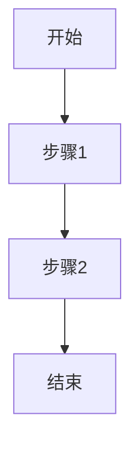

# Markdown写作指南

## 基本概念

Markdown 是一种轻量级标记语言，使用简洁的语法来格式化文本。它被广泛用于博客、文档、README 文件等场景。

## 基本语法

### 1. 标题

```markdown
# 一级标题
## 二级标题
### 三级标题
#### 四级标题
##### 五级标题
###### 六级标题
```

### 2. 文本格式化

```markdown
**粗体文本**
*斜体文本*
***粗斜体文本***
~~删除线文本~~
<u>下划线文本</u>
`行内代码`
```

### 3. 列表

#### 无序列表

```markdown
- 项目一
- 项目二
  - 子项目一
  - 子项目二
- 项目三
```

#### 有序列表

```markdown
1. 第一步
2. 第二步
   1. 子步骤一
   2. 子步骤二
3. 第三步
```

### 4. 链接

```markdown
[链接文本](https://example.com)
[链接文本](https://example.com "链接标题")
<https://example.com>  <!-- 自动链接 -->
```

### 5. 图片

```markdown


```

### 6. 引用

```markdown
> 这是一段引用文本
> 
> 引用可以跨多行
```

### 7. 代码块

#### 普通代码块

```markdown
```
const hello = "Hello, world!";
console.log(hello);
```
```

#### 带语法高亮的代码块

```markdown
```javascript
const hello = "Hello, world!";
console.log(hello);
```

```python
def hello():
    print("Hello, world!")
```
```

### 8. 表格

```markdown
| 表头1 | 表头2 | 表头3 |
|-------|-------|-------|
| 内容1 | 内容2 | 内容3 |
| 内容4 | 内容5 | 内容6 |

| 左对齐 | 居中对齐 | 右对齐 |
| :--- | :---: | ---: |
| 内容1 | 内容2 | 内容3 |
```

### 9. 分隔线

```markdown
---
***
___
```

### 10. 转义字符

```markdown
\* 这不是斜体 \*
\_ 这不是下划线 \_
\` 这不是行内代码 \`
\[ 这不是链接 \]
```

## 扩展语法

### 1. 任务列表

```markdown
- [x] 已完成的任务
- [ ] 未完成的任务
- [ ] 另一个未完成的任务
```

### 2. 脚注

```markdown
这里有一个脚注[^1]

[^1]: 这是脚注的内容
```

### 3. 定义列表

```markdown
术语
: 术语的定义

另一个术语
: 另一个术语的定义
```

### 4. 代码围栏

```markdown
```
这是代码围栏
```

```javascript
// 带语言标记的代码围栏
const code = "示例";
```
```

### 5. 数学公式

#### 行内公式

```markdown
$E = mc^2$
```

#### 块级公式

```markdown
$$
E = mc^2
$$
```

### 6. 图表

#### Mermaid 图表

```markdown

```

### 7. 警告框

```markdown
::: tip
这是提示信息
:::

::: warning
这是警告信息
:::

::: danger
这是危险信息
:::
```

## 博客文章格式

### 1. Frontmatter

```markdown
---
title: 文章标题
published: 2026-04-24
description: 文章描述
tags: [标签1, 标签2]
category: 分类
author: 作者
image: ./images/cover.jpg
draft: false
---
```

### 2. 文章结构

```markdown
---
frontmatter
---

# 文章大标题

## 章节标题

### 子章节标题

正文内容...

## 另一个章节

### 子章节

正文内容...

## 结论

总结内容...
```

## 最佳实践

### 1. 标题层级

- 使用 `#` 到 `######` 表示标题层级
- 保持标题层级的一致性
- 每个页面只使用一个一级标题

### 2. 文本格式

- 合理使用粗体、斜体等格式
- 避免过度使用格式化
- 保持文本的可读性

### 3. 代码块

- 为代码块添加语言标记
- 保持代码的缩进和格式
- 对于较长的代码，考虑使用代码折叠

### 4. 图片使用

- 使用合适的图片尺寸
- 添加图片描述
- 优化图片加载速度
- 考虑使用图床

### 5. 链接管理

- 使用相对路径引用本地资源
- 外部链接使用绝对路径
- 定期检查链接的有效性

### 6. 内容组织

- 保持段落简短（每段 2-4 句话）
- 使用列表和引用提高可读性
- 合理使用分隔线
- 保持内容的逻辑结构

## 工具推荐

### 1. Markdown 编辑器

| 编辑器 | 平台 | 特点 |
|-------|------|------|
| VS Code | 全平台 | 插件丰富，功能强大 |
| Typora | 全平台 | 所见即所得 |
| Obsidian | 全平台 | 知识管理，双向链接 |
| MarkText | 全平台 | 开源，功能全面 |
| iA Writer | 全平台 | 简洁专注 |

### 2. 在线工具

- [Markdown Live Preview](https://markdownlivepreview.com/)
- [StackEdit](https://stackedit.io/)
- [Dillinger](https://dillinger.io/)
- [Markdown Table Generator](https://www.tablesgenerator.com/markdown_tables)

### 3. 浏览器扩展

- Markdown Viewer (Chrome)
- Markdown Here (Gmail)
- Markdown Preview Plus (Firefox)

## 常见问题

### Q: 图片不显示？

1. 检查图片路径是否正确
2. 确认图片文件是否存在
3. 检查图片格式是否支持
4. 清除浏览器缓存

### Q: 代码高亮不生效？

1. 确保代码块有正确的语言标记
2. 检查是否支持该语言的高亮
3. 确认代码块格式正确

### Q: 表格显示异常？

1. 确保表格语法正确
2. 检查对齐标记是否正确
3. 避免表格单元格内容过长

### Q: 数学公式不渲染？

1. 确认数学公式语法正确
2. 检查是否启用了数学公式支持
3. 测试不同的公式语法

### Q: 链接点击没反应？

1. 检查链接格式是否正确
2. 确认链接地址有效
3. 检查是否有 JavaScript 阻止点击

## 高级技巧

### 1. 自定义容器

```markdown
::: info
这是信息容器
:::

::: note
这是笔记容器
:::

::: quote
这是引用容器
:::
```

### 2. 嵌入内容

#### 嵌入 YouTube 视频

```markdown
<iframe width="560" height="315" src="https://www.youtube.com/embed/dQw4w9WgXcQ" title="YouTube video player" frameborder="0" allow="accelerometer; autoplay; clipboard-write; encrypted-media; gyroscope; picture-in-picture" allowfullscreen></iframe>
```

#### 嵌入 Gist

```markdown
<script src="https://gist.github.com/username/gist-id.js"></script>
```

### 3. 响应式图片

```markdown


<style>
.responsive-image {
    max-width: 100%;
    height: auto;
}
</style>
```

### 4. 自定义样式

```markdown
<span style="color: red; font-weight: bold;">红色粗体文本</span>

<div style="background-color: #f0f0f0; padding: 10px; border-radius: 5px;">
  自定义背景的文本
</div>
```

### 5. 自动生成目录

```markdown
[TOC]

# 第一章
## 第一节
## 第二节

# 第二章
## 第一节
```

## 性能优化

### 1. 图片优化

- 使用 WebP 格式
- 压缩图片大小
- 懒加载图片
- 使用适当的图片尺寸

### 2. 代码优化

- 代码块使用语法高亮
- 长代码使用折叠
- 避免过多的代码块

### 3. 内容优化

- 保持内容简洁
- 避免过多的格式化
- 合理使用分隔符
- 保持段落简短

### 4. 加载优化

- 减少外部资源
- 优化 Markdown 解析
- 使用缓存策略
- 预加载关键资源

## 总结

Markdown 是一种简单而强大的标记语言，掌握它可以帮助你更高效地编写博客文章。通过本文介绍的语法和技巧，你可以创建格式美观、结构清晰的内容。

**建议**：
- 定期练习 Markdown 语法
- 使用专业的 Markdown 编辑器
- 参考优秀的 Markdown 示例
- 保持良好的写作习惯

希望本指南能帮助你更好地使用 Markdown 编写博客文章！